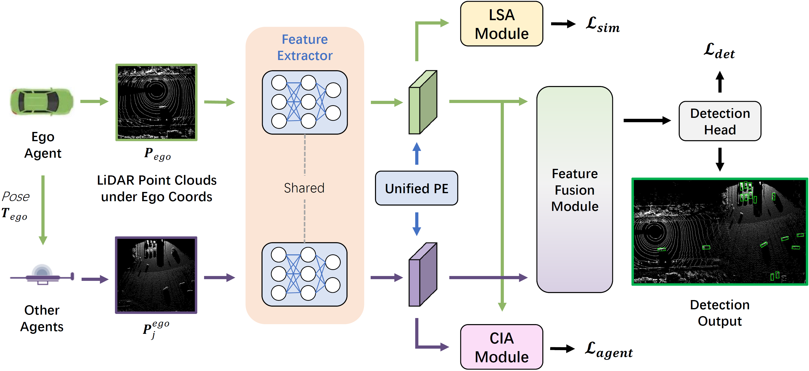

# DUSA: Decoupled Unsupervised Sim2Real Adaptation for Vehicle-to-Everything Collaborative Perception

Official implementation of the **ACM MM 2023** paper **DUSA: Decoupled Unsupervised Sim2Real Adaptation for Vehicle-to-Everything Collaborative Perception** [[Link]](https://dl.acm.org/doi/10.1145/3581783.3611948).

<div align="center"></div>

## News

- 11/17/2023: Initial release 🎉🎉🎉.
  
## Features

- Provide easy data API for multiple popular multi-agent perception dataset
  - [x] [OPV2V [ICRA 2022]](https://mobility-lab.seas.ucla.edu/opv2v/)
  - [x] [V2XSet [ECCV 2022]](https://link.springer.com/chapter/10.1007/978-3-031-19842-7_7)
  - [x] [DAIR-V2X [CVPR 2022]](https://openaccess.thecvf.com/content/CVPR2022/html/Yu_DAIR-V2X_A_Large-Scale_Dataset_for_Vehicle-Infrastructure_Cooperative_3D_Object_Detection_CVPR_2022_paper.html)
- Provide multiple SOTA 3D detection backbone
  - [x] [PointPillars](https://openaccess.thecvf.com/content_CVPR_2019/html/Lang_PointPillars_Fast_Encoders_for_Object_Detection_From_Point_Clouds_CVPR_2019_paper.html)
  - [ ] [Pixor](https://openaccess.thecvf.com/content_cvpr_2018/html/Yang_PIXOR_Real-Time_3D_CVPR_2018_paper.html)
  - [ ] [VoxelNet](https://openaccess.thecvf.com/content_cvpr_2018/html/Zhou_VoxelNet_End-to-End_Learning_CVPR_2018_paper.html)
  - [ ] [SECOND](https://www.mdpi.com/1424-8220/18/10/3337)
- Support multiple sparse convolution versions
  - [ ] Spconv 1.2.1
  - [x] Spconv 2.x
- Support SOTA multi-agent perception models
  - [ ] [Cooper [ICDCS 2019]](https://ieeexplore.ieee.org/abstract/document/8885377)
  - [x] [F-Cooper [SEC 2019]](https://dl.acm.org/doi/abs/10.1145/3318216.3363300)
  - [ ] [V2VNet [ECCV 2020]](https://link.springer.com/chapter/10.1007/978-3-030-58536-5_36)
  - [x] [DiscoNet (Student Only) [NeurIPS 2021]](https://proceedings.neurips.cc/paper/2021/hash/f702defbc67edb455949f46babab0c18-Abstract.html)
  - [ ] [Attentive Fusion [ICRA 2022]](https://ieeexplore.ieee.org/abstract/document/9812038)
  - [x] [V2X-ViT [ECCV 2022]](https://link.springer.com/chapter/10.1007/978-3-031-19842-7_7)
  - [x] [CoBEVT [CoRL 2022]](https://arxiv.org/abs/2207.02202)  
  - [ ] [Where2comm [NeurIPS 2022]](https://proceedings.neurips.cc/paper_files/paper/2022/hash/1f5c5cd01b864d53cc5fa0a3472e152e-Abstract-Conference.html)
  - [ ] [FPV-RCNN [RAL 2022]](https://ieeexplore.ieee.org/abstract/document/9682601)

- **Provide a convenient log replay toolbox for the OPV2V dataset.** Check [here](logreplay/README.md) for more details.

## Data Preparation

### OPV2V & V2XSet

All the data can be downloaded from google drive: [OPV2V](https://drive.google.com/drive/folders/1dkDeHlwOVbmgXcDazZvO6TFEZ6V_7WUu), [V2XSet](https://drive.google.com/drive/folders/1r5sPiBEvo8Xby-nMaWUTnJIPK6WhY1B6?usp=sharing). If you have a good Internet connection, you may directly download the complete large zip file such as `train.zip`. In case you suffer from downloading large files, the link also provides split small chunks, which can be found in the directory ending with `_chunks`, such as `train_chunks`. After downloading, please run the following command to each set to merge those chunks together:

```sh
cat train.zip.part* > train.zip
unzip train.zip
```

After extraction, please make the file structured as following:

```sh
├── v2xset  # the downloaded data
    ├── train
    ├── validate
    ├── test
```

### DAIR-V2X-C

The DAIR-V2X-C dataset can be downloaded from the [official website](https://thudair.baai.ac.cn/coop-dtest).

### Complemented Annotations for DAIR-V2X-C 🌟

Originally, DAIR-V2X-C only annotates 3D boxes within the range of camera's view in vehicle-side. CoAlign supplement the missing 3D box annotations to enable the 360 degree detection. With fully complemented vehicle-side labels, CoAlign regenerate the cooperative labels for users, which follow the original cooperative label format.

**Download:** [Google Drive](https://drive.google.com/file/d/13g3APNeHBVjPcF-nTuUoNOSGyTzdfnUK/view?usp=sharing)

**Website:** [Website](https://siheng-chen.github.io/dataset/dair-v2x-c-complemented/)

## Installation

Please follow the commands in `install.sh` to install the dependencies. We recommend using conda to manage the environment.

You may also refer to [data introduction](https://opencood.readthedocs.io/en/latest/md_files/data_intro.html) and [installation](https://opencood.readthedocs.io/en/latest/md_files/installation.html) of OpenCOOD to help you understand the project structure.

## Quick Start

### Data Sequence Visualization

To quickly visualize the LiDAR stream in the OPV2V dataset, first modify the `validate_dir` in your `opencood/hypes_yaml/visualization.yaml` to the OPV2V data path on your local machine, e.g. `opv2v/validate`, and then run the following command:

```python
cd ~/DUSA
python opencood/visualization/vis_data_sequence.py [--color_mode ${COLOR_RENDERING_MODE}]
```

Arguments Explanation:

- `color_mode` : str type, indicating the lidar color rendering mode. You can choose from 'constant', 'intensity' or 'z-value'.

### Training

DUSA uses yaml file to configure most of the parameters for training. To train your own model from scratch or a specific checkpoint, run the following commands:

```sh
python opencood/tools/train.py --hypes_yaml ${CONFIG_FILE} [--model_dir  ${CHECKPOINT_FOLDER} --half --adv_training --target_domain_suffix ${TARGET_DOMAIN} --use_pseudo_label --pseudo_label_id ${ID}]
```

Arguments Explanation:

- `hypes_yaml`: the path of the training configuration file, e.g. `opencood/hypes_yaml/second_early_fusion.yaml`, meaning you want to train an early fusion model which utilizes SECOND as the backbone. See [Tutorial 1: Config System](https://opencood.readthedocs.io/en/latest/md_files/config_tutorial.html) to learn more about the rules of the yaml files.
- `model_dir` (optional) : the path of the checkpoints. This is used to fine-tune the trained models. When the `model_dir` is given, the trainer will discard the `hypes_yaml` and load the `config.yaml` in the checkpoint folder.
- `half` (optional): If set, the model will be trained with half precision. It cannot be set with multi-gpu training togetger.
- `adv_training` (optional): If set, the model will be trained with adversarial training.
- `target_domain_suffix` (optional): Yaml filename suffix of the target domain of adversarial training. Default: `dair`.
- `use_pseudo_label` (optional): If set, the model will be trained with pseudo label.
- `pseudo_label_id` (optional): The id of the pseudo label. Default: `0`.

To train on **multiple gpus**, run the following command:

```sh
CUDA_VISIBLE_DEVICES="0,1,2,3" python -m torch.distributed.launch --nproc_per_node=4  --use_env opencood/tools/train.py --hypes_yaml ${CONFIG_FILE} [--model_dir  ${CHECKPOINT_FOLDER} --adv_training --target_domain_suffix ${TARGET_DOMAIN} --use_pseudo_label --pseudo_label_id ${ID}]
```

### Inference

Before you run the following command, first make sure the `validation_dir` in config.yaml under your checkpoint folder refers to the testing dataset path, e.g. `opv2v_data_dumping/test`.

```sh
python opencood/tools/inference.py --model_dir ${CHECKPOINT_FOLDER} --fusion_method ${FUSION_STRATEGY} [--show_vis] [--show_sequence] [--save_pseudo_label] [--pseudo_label_id ${ID}]
```

Arguments Explanation:

- `model_dir`: the path to your saved model.
- `fusion_method`: indicate the fusion strategy, currently support 'early', 'late', and 'intermediate'.
- `show_vis`(optional): whether to visualize the detection overlay with point cloud.
- `show_sequence` (optional): the detection results will visualized in a video stream. It can NOT be set with `show_vis` at the same time.
- `save_pseudo_label` (optional): whether to save the pseudo label for the target domain.
- `pseudo_label_id` (optional): The id of the pseudo label. Default: `0`.

The evaluation results will be dumped in the model directory.

## Citation

 If you are using DUSA for your research, please cite the following paper:

 ```bibtex
@inproceedings{kong2023dusa,
  title={DUSA: Decoupled Unsupervised Sim2Real Adaptation for Vehicle-to-Everything Collaborative Perception},
  author={Kong, Xianghao and Jiang, Wentao and Jia, Jinrang and Shi, Yifeng and Xu, Runsheng and Liu, Si},
  booktitle={Proceedings of the 31st ACM International Conference on Multimedia},
  pages={1943--1954},
  year={2023}
}
```

## Acknowledgements

This project is built upon [OpenCOOD](https://github.com/DerrickXuNu/OpenCOOD) and [CoAlign](https://github.com/yifanlu0227/CoAlign). Thanks again to [@DerrickXuNu](https://github.com/DerrickXuNu) for his great code framework.
